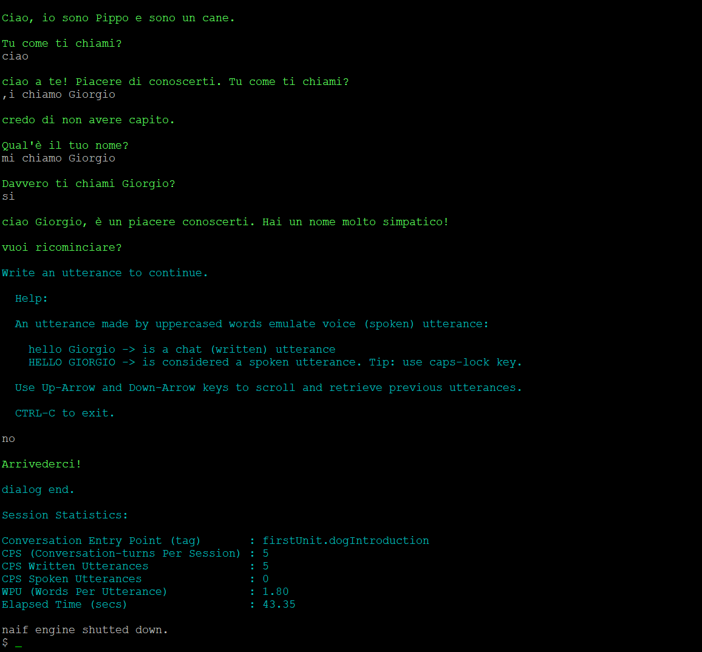
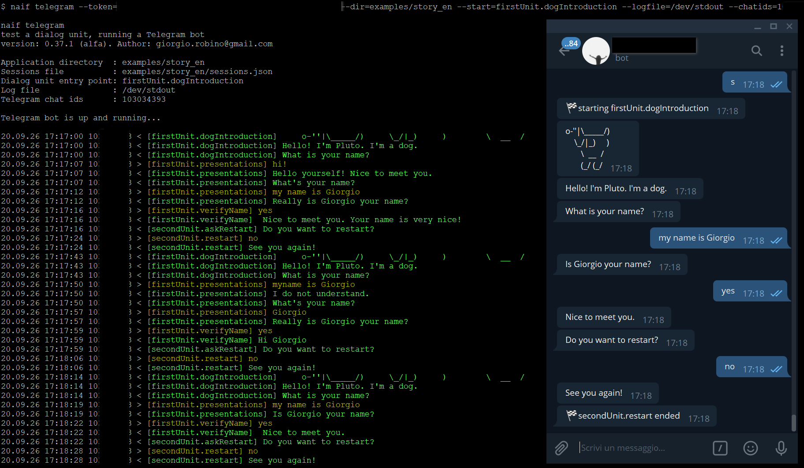

# `naif` command line interface tools

 ⚠️  To be completed.

- [`naif`](#naif) 
- [`naif init`](#naif-init) 
- [`naif generate`](#naif-generate) 
- [`naif show`](#naif-show) 
- [`naif shell`](#naif-shell) 
- [`naif telegram`](#naif-telegram)


## `naif` 

```
$ naif
 _   _       _  __     _
| \ | |     (_)/ _|   | |
|  \| | __ _ _| |_    | |___
| . ` |/ _` | |  _|   | / __|
| |\  | (_| | | || |__| \__ \
|_| \_|\__,_|_|_| \____/|___/

NaifJs, simple state-machine based dialog manager
version: 0.46.1, author: giorgio.robino@gmail.com

Documentation:
/usr/local/lib/node_modules/naifjs/README.md

Examples:
/usr/local/lib/node_modules/naifjs/examples

Usage:

    naif init              create new project directory
    naif new project

    naif generate          create dialog unit skeleton source code.
    naif new unit

    naif shell             command line dialog tester
    naif test shell

    naif telegram          telegram bot dialog tester
    naif test telegram

    naif show              show dialog units and states of a directory.

    naif help              show this help

``` 

## `naif init` 

Create a dialog project directory
```
$ naif init
 _   _       _  __     _
| \ | |     (_)/ _|   | |
|  \| | __ _ _| |_    | |___
| . ` |/ _` | |  _|   | / __|
| |\  | (_| | | || |__| \__ \
|_| \_|\__,_|_|_| \____/|___/

NaifJs, simple state-machine based dialog manager
version: 0.46.1, author: giorgio.robino@gmail.com

Create a dialog project directory

Usage:
    naif init

    --dir=<directory path>
      Dialog units directory path

Examples:

   naif init
   naif init --dir=./examples/myApplication
```


## `naif generate` 

Create dialog unit skeleton source code

```
$ naif generate
 _   _       _  __     _
| \ | |     (_)/ _|   | |
|  \| | __ _ _| |_    | |___
| . ` |/ _` | |  _|   | / __|
| |\  | (_| | | || |__| \__ \
|_| \_|\__,_|_|_| \____/|___/

NaifJs, simple state-machine based dialog manager
version: 0.46.1, author: giorgio.robino@gmail.com

Create dialog unit skeleton source code

Usage:

    naif new dialog
    naif new unit

    --dir=<directory path>
      Dialog units directory path

    --unit=<unit name>
      Name of the dialog unit

    [--desc=<description>]
       Unit name description (for dialog user)

    [--outstates=<stateName1,stateName2,...>]
       List of output state names, comma separated

    --instates=<stateName1:numPatterns1,stateName2:numPattern2,...>
      List of input state names, comma separated
      Each input state name is colon separated by a number of patterns

     [-e]
       end case in pattern

     [-h]
       help case in pattern

Examples:

   naif new --unit=myUnit --dir=tmp/dialogs/aDialog --instates=oneState:4

   naif new --unit=indovinalaparola \
            --dir=./examples/indovinalaparola \
            --desc="Indovina La Parola" \
            --outstates=start \
            --instates=input1:2,input2:3
```


## `naif show` 

Dialog Units Description

```
$ naif show
 _   _       _  __     _
| \ | |     (_)/ _|   | |
|  \| | __ _ _| |_    | |___
| . ` |/ _` | |  _|   | / __|
| |\  | (_| | | || |__| \__ \
|_| \_|\__,_|_|_| \____/|___/

NaifJs, simple state-machine based dialog manager
version: 0.46.1, author: giorgio.robino@gmail.com

Dialog Units Description

Usage:
    naif show

    --dir=<directory path>
      Dialog units directory path

Examples:

   naif show --dir=./examples/myApplication
```


## `naif shell` 

Command line dialog tester

```
$ naif shell
 _   _       _  __     _
| \ | |     (_)/ _|   | |
|  \| | __ _ _| |_    | |___
| . ` |/ _` | |  _|   | / __|
| |\  | (_| | | || |__| \__ \
|_| \_|\__,_|_|_| \____/|___/

NaifJs, simple state-machine based dialog manager
version: 0.46.1, author: giorgio.robino@gmail.com

Command line dialog tester

Usage:

    naif shell
    naif test shell

    --dir=<directory path>
      Dialog units directory path

    --start=<unit.state>
      Initial dialog stateid in format "unit.state"

    [--id=<id>]
       session id. Optional argument

    [--logfile=<path/filename>]
       Log filename with directory path

    [--sessionsfile=<path/filename>]
       Sessions filename with directory path

    [--silent -s]
       Silent mode. Just dialog

Examples:

   naif test --start=firstUnit.start --dir=examples/myDialogs

   naif test --dir=examples/app \
             --start=anotherUnit.showContents \
             --id=123456 \
             --logfile=examples/app/dialogs.log \
             --sessionsfile=examples/app/sessions.json
```


|  |
|:--:|
| figure 1: `naif test --dir=examples/story_it --start=firstUnit.dogIntroduction`.  |


## `naif telegram` 

Telegram bot (on-the fly server) dialog tester

```
$ naif telegram
 _   _       _  __     _
| \ | |     (_)/ _|   | |
|  \| | __ _ _| |_    | |___
| . ` |/ _` | |  _|   | / __|
| |\  | (_| | | || |__| \__ \
|_| \_|\__,_|_|_| \____/|___/

NaifJs, simple state-machine based dialog manager
version: 0.46.1, author: giorgio.robino@gmail.com

Telegram bot (on-the fly server) dialog tester:
A single specified dialog run on the instant messaging app.
To test multimedia chat interaction, with multiple users at once.

Usage:

    naif test telegram
    naif telegram

    --token=<your telegram bot token id>

    --dir=<directory path>
      Dialog units directory path

    --start=<unit.state>
      Initial dialog stateid in format "unit.state"

    [--chatids=<chatid1,chatid2,...>]
       list of telegram chat ids (comma separated, no blanks)

    [--logfile=<path/filename>]
       Log filename with directory path

    [--sessionsfile=<path/filename>]
       Sessions filename with directory path

Examples:

   naif telegram --token=YOUR_TELEGRAM_BOT_TOKEN \
                 --dir=examples/yourApp \
                 --start=yourDialogUnit.startState \
                 --chatids=123456789,923465768,228765452 \
                 --logfile=/dev/stdout \
                 --sessionsfile=yourApp/sessions.json
```

|  |
|:--:|
| figure 2: using `naif telegram`. On backgrond the terminal. On the right the telegram bot running a dialog |

---

[top](#) | [home](../README.md) | [index](index.md)
