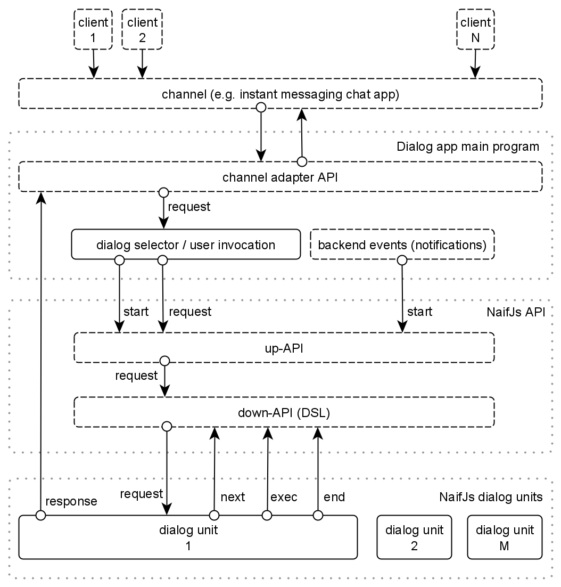
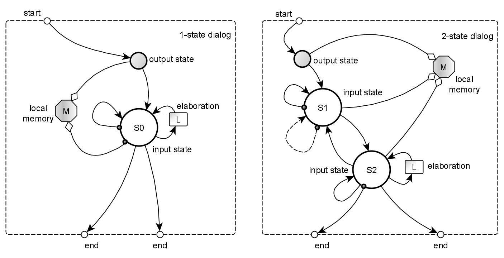
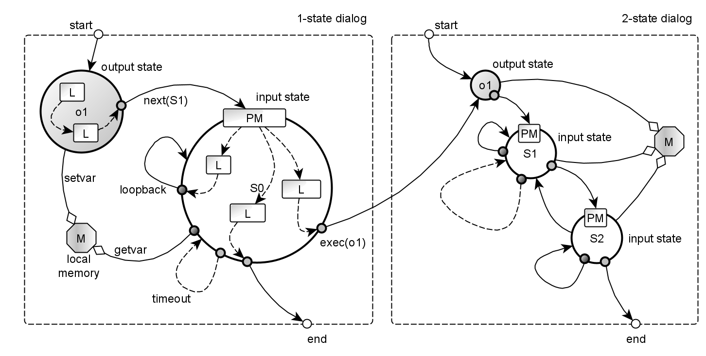
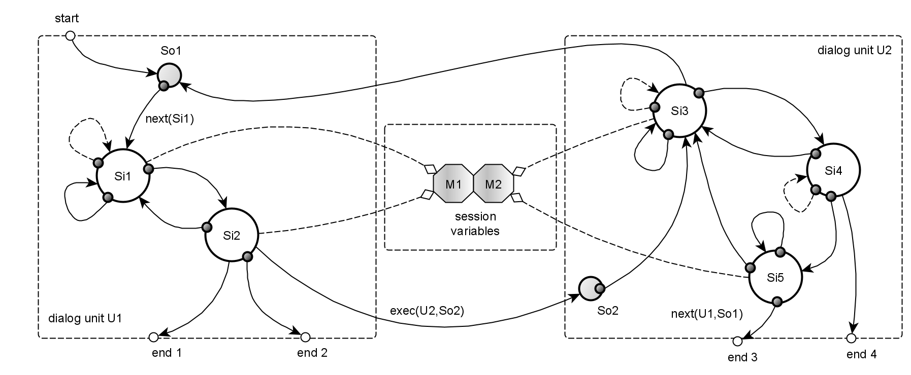

# NaifJs Concepts

- Dialog system
  - [Stateful multi-turn dialogues](#stateful-multi-turn-dialogues)
  - [Architecture](#architecture)

- State-machine based dialog manager 
  - [Dialogue as a state-machine](dialogue-as-a-state-machine)
  - [State tracker](#state-tracker)

- What is a dialog unit?
  - [Dialog Unit](#dialog-unit)
  - [Coding a dialogue with a javascript domain specific language](#coding-a-dialogue-with-a-javascript-domain-specific-language)
  - [Requests and responses](#requests-and-responses)

- Whats is an Application?
  - [Dialog application](#dialog-application)
  - [Sessions](#dialog-application)


## Stateful multi-turn dialogues

A dialogue is an exchange of words between two or more people, speaking a natural language. 

In a human-computer interaction context, dialogue takes place between two systems: 
the user (A) and a computer program B, usually called *chatbot* or *conversational agent* 
(I prefer to say *dialog system*, or *conversational application*).

Consider this simple turn-taking:

> A > what time is it?<br>
> B < it's half past seven.<br>

It's a dialogue? 
In a broad sense yes, but it's a special case of conversation because it finish after just a single back and forth exchange.
I call *0-state dialogue* this *single-turn* scenario, because the conversation is apparently *stateless*. 

So I prefer to define as dialogue a *multi-turn* *stateful* turn-taking between two systems.

> A > Is it expected to rain today?<br>
> B < There’s no rain today, there’s sunshine and the temperature is 18 degrees centigrade.<br>
>
> A > Well, how about tomorrow?<br>
> B < It will rain tomorrow.<br>

In the exchange of sequences here above, 
the topic of the conversation concerns the weather forecast. 

The initial question of system A (the user) brings system B (the chatbot) to an *internal state*, 
which maintains the topic of discussion, 
so that the subsequent user request is understood in the specific context "weather forecast". 
This is an example of elementary multi-turn conversation (I call *state-1*).

It is therefore possible to model more complex dialog as  a finite state machine,
where two interacting systems (for example A is a human being and B is a chatbot), 
evolve into successive conversational states.


## Architecture

The general architecture of a dialog system based on NaifJs is shown in figure 1. 

|  |
|:--:|
| figure 1: Dialogue system architecture, using NaifJs |

We consider a multiuser scenario where many users can interact the dialogue system. 
The main software components are:

- The channel 

  It's where users interact. 
  It could be by example an instant messaging platform, a group chat platform, an email client, etc. 

- The channel adapter API

  The outside interface component of the main program is the channel API 
  that allow to send and receive messages to the channel. 

  ASR/TTS (speech transcript / text-to-speech) sub-modules
  could be part of this component if messages include voice processing.
  A message containing different types of multimodal data is an inbound `request` to the dialog system. 
  Backwards, dialog system outbound `response` message is translated by the adapter following the specific message data types.

  > A multi-channel application is realized with a dialog system backend 
  > that's able to manage more than one channel in parallel. 

- The dialog selection/activation 
 
  NaifJs is built on the idea that user interacts with the dialog system activating, one at a time, 
  a specific task-oriented or topic-oriented conversational workflow,
  that I call *dialog unit*, each one implemented as a dedicated state machine. 

  There are two distinct kind of events that trigger a new dialog: 

  - *Pull events* (user sentence invocation)

    The core logic of the main application program must contain a dialog selector 
    that activates (`start`) a corresponding dialog unit (*pull mode*). 
    A common case is that a dialog unit is triggered when a specific *invocation sentence* that user input, 
    is matched by the dialog selector module (a sort of main node).

  - *Push events* (backend logic trigger)

    Another way to activate the dialogue is an event generated by some backend logic.
    It's common to push user with notification-based conversations, 
    maybe following agent-initiative-based logic, 
    by example events generated by some cron-based logic (*pull mode*).
 
- The dialogue manager
 
  The NaifJs dialog manager passes inbound channel requests to underlying dialog units, 
  is in charge to schedule a track the internal state of a dialog 
  and at least send outbound responses to the channel adapter.
 
- The conversational application (project)

  An application (or project) is made by:
  - a main program containing the invocation logic of *dialog units*.
  - a set of (standalone or interconnected) dialog units,
    "self-consistent" finite state machines (FSM), single *units* of conversational logic 
    that accomplish some specific application workflows,
    micro-skills that accomplish specific tasks.
 
## Dialog as a state-machine

NaifJs is a dialog manager that implements dialog management 
modeling a conversation as a finite state machine 
([FSM](https://en.wikipedia.org/wiki/Finite-state_machine)), 

A conversation in NaifJs can be thought of as traversing the state machine's nodes, 
to be considered as a graph of *states*.

### State representation

Each *node* (or *state*) of the graph has an associated unique identifier (*stateid*), 
a string label identifying both the state machine (the dialog unit) 
and the specific state inside the dialog unit):

```
const stateid = 'myDialogUnit.myState'
``` 

Where:

- `myDialogUnit` is the name of the state machine 
  (corresponding to a unique dialogue unit file: `myDialogUnit.js`)
- `myState` is the name of the javascript function handler `myState()`

### Input and output states

In each state machine there are two different kind of nodes:

- *input state*
 
  It's a *wait node* of "understanding" and local processing of input requests (user *utterances*). 
  The inbound user sentence is matched with some kind of [pattern matching](patternmatching.md) 
  (e.g. Regular Expressions) and each matched *intent* triggers an *action* (any backend logic). 
  Lastly, a response message is feed back to user. 
  See nodes *S1* and *S2* in figure 2.
  The input state is triggered with `next('myDialogueUnit.myInputState')` DSL.

- *output state* 
 
  It's an execution node that makes some backend elaboration and produce a message/prompt (response) to the user. 
  The output state can be considered as the *action* part of previous described input state. 
  It's triggered with `exec('myDialogueUnit.myOutputputState')` DSL.


### "Rule-based" state transitions

Transitions between states take places for two kind of events:

- External events
 
  These are the `start` of the state-machine and any successive `request`. 
 
  A dialogue is initially activated by a caller program (with `start` function) 
  that activate the initial state (an output state, in current implementation).
  The node performs some kind of logic (L, in figure 2), usually (but non perforce) 
  feedback a `response` to the user and can store contextual (shared) memory variables (M). 
  The response to the user is any kind of message 
  (can be a text, a voice message, an image or audio/video content).

- Internal events

  Transitions between any successive internal node is decided by programmer, 
  that explicitly move 

  - to the target output state with `exec` function
  - to the target input state  with `next` function
 
> 👉 State transitions are deterministic and "rule-based", 
> being programmed by developer, 
> in the action part of [pattern matching](patternmatching.md) rules. 

|  |
|:--:|
| figure 2: at the left a *1-state* *dialogue unit*, containing an *output state*, an *input state*, a local memory. At the right a *2-state* dialogue unit, containing 2 input states, an input state, a local memory. |


## State tracker

The engine is just a *conversation state* scheduler/tracker. 

As soon a dialogue state machine is activated from a main program (acting as a *main state*), 
the NaifJs engine track the conversation state (*stateid*) and schedule next state.

The incoming user request event (the user utterance as text), run a state handler function.

```javascript
// dialog manager set a specific state-machine state
naif.start('myDialogUnit.myState')

// when user talk to the agent:
naif.request(user, utterance)
```

To progress the dialogue flow, the initial (output) state usually send some reply to the user 
and activates a subsequent input state (using `next` DSL function), 
in which the dialogue manager analyzes the user's response (a sentence in natural language)
and performs a contextual interpretation based on a [pattern matching](patternmatching.md) (PM). 

> The dialogue manager is agnostic with respect
> to the NLU mechanism and for simplicity and efficiency
> the parsing has been implemented with the use of regular expressions (regexp). 

In the case of a positive pattern match, 
the input node performs some processing and a response is given to the user.
The response could be textual, a synthetic voice speech or other multimedia audio/video content. 

The current state can evolve into a successive input state (using `next` API), 
a successive output state (using `exec` API) or might not change 
(*loopback*, see the dotted lines in figure 3),
based on a dialog flow programmed by the designer. 

The dialog flow finally ends, when developer terminate the conversation, 
exiting the state machine (with `end` API).

|  |
|:--:|
| figure 3: at the left, the *1-state* dialogue unit, where the input state is detailed. |


## Dialog Unit

To complete a specific task (a workflow), 
a multi-turn conversation is implemented as a network of micro-dialogues, 
called *dialog units*, each containing a graph of nodes that completes a *contextual* 
(related to in a specific domain and task) conversation workflow. 

A dialog unit is a finite state machine (FSM), 
a single *unit* of conversational logic allowing accomplish any specific application workflow.

> 👉 From coder point of view, each dialog unit is a standalone file, 
> exporting a module that implement a single state machine, or micro-dialogue, 
> that has an entry point (the initial state) and one or more ends.
>
> These dialog units modules could be concatenated each other, resulting a complex dialogue. 
> Each dialogue unit can receive input parameters, following a sort of functional programming model. 

|  |
|:--:|
| figure 4: a more complex state machine, made by 2 interconnected dialogue units. |


### Session variables

Each dialogue unit has a *short-term memory* made by persistent variables 
with local scope to the unit itself, but shared among all dialog units part of the same application.

> 👉 More details in [variables](variables.md) and [sessions](session.md) docs.


### Writing a dialogue with a javascript DSL

To write a *dialogue unit* in NaifJs, the developer just write vanilla javascript code, 
added by NaifJs internal [domain specific language (DSL)](API.md#down-dialogue-api) functions
that define how input and output states (nodes) of the state machine are interconnected.

Each state machine correspond to a dialog unit, an unique javascript module file 
containing a list of functions (handlers) for each *input state*, 
and *output state* of the designed state machine.


### Requests and responses

NaifJs is a backend dialog manager engine, multi-user, channel agnostic, message agnostic. 

The dialog engine interacts with the external system, receiving and sending messages. 
The platform is pretty agnostic regarding media contents in `request` and `response` messages. 

> 👉 Read more [here](requestresponse.md).


### A simple example of a dialog unit

Suppose we want to implement a simple dialog unit 
that ask the user his name, and terminates. 

As soon the dialog is activated (with `naif.start('getUserName.askName')`), 
the output state `askName` handler is triggered. 
The state simply prompt the user and goto the input state with `next(getName)`.
Note that `say` and `ask` are specialized versions of generic `response` function.

> The example dialogue is a 1-state, 
> because it contains just a single input state handler (`getname`). 

Here below the basic code:

```javascript
// dialog unit file: getUserName.js
const getUserName = { askName, getName }
  
// output state 
function askName() {
  ask('Hello! What\'s your name?') 
  next('getUserName.askName')
}

// input state
function getName(sentence) {
  switch (take(sentence)) {

    // pattern 1: reply to greetings
    case match( /hi|hello|good morning|good afternoon/i ): 
      ask('Hi there! What\'s your name?')
      break
   
    // pattern 2: regexp rule to get a first name (e.g. Anna Lisa, Giorgio La Malfa)
    case match( /^(my name is |name me |i\'m )?(?<firstName>[A-Z][a-z]{1,}(\\s[A-Z][a-z]{1,})*)/i ): 
      say(`Nice to meet you, ${slots().firstName}?`)
      end()
      break
     
    // fallback
    default: 
      say( 'I do not understand.' )
      ask( 'What is your name?' )
      break
  }
}

module.exports = getUserName 
```


## [Dialog application](application.md)

An application (or project) is made by:

- a main program containing the invocation logic of *dialog units*.
- a set of dialogue units files, 
  currently contained in a single specified directory, 
  implementing all workflows of a specific application. 

  See:

- 👉 [An application example (Telegram Bot)](application.md#an-application-example--Telegram-Bot-)
- 👉 [Sessions](sessions.md)
- 👉 [Project examples](../examples/README.md)


---

[top](#) | [home](../README.md) | [index](index.md)
